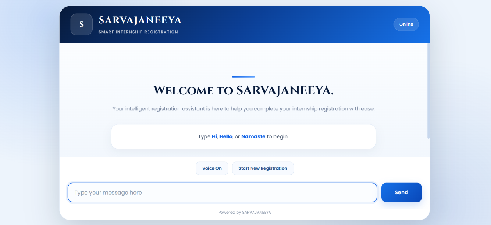
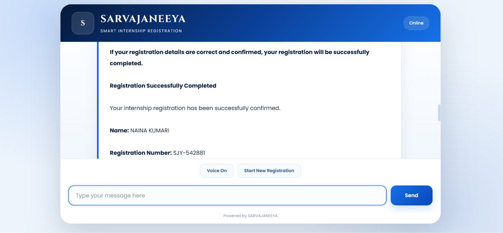

# SARVAJANEEYA

## Intelligent AI Registration Assistant

SARVAJANEEYA is an AI-powered conversational registration assistant designed to make internship and online registration processes easier, faster, and more user-friendly.

The system allows users to complete registration through a simple chat-based interface instead of filling long and complicated forms manually.

It combines **Natural Language Processing (NLP), Machine Learning, Intent Recognition, Entity Extraction, Conversation State Management, REST APIs, Data Validation, Data Storage, and Browser-Based Voice Assistance** into one complete application.

---

## Live Application

https://ai-registration-assistant-prra.onrender.com

## GitHub Repository

https://github.com/Naina137/SARVAJEENYA-Registration-Assistant.git

## LinkedIn

https://www.linkedin.com/in/naina-kumari-06373132b/

---

#  Project Introduction

Online registration systems are widely used for internships, scholarships, government schemes, educational programs, applications, and other services.

However, many users face difficulties because of:

- Long registration forms
- Complex interfaces
- English-heavy instructions
- Lack of digital confidence
- Repeated form filling
- Validation errors
- Difficulty understanding what information is required

To solve these problems, **SARVAJANEEYA** provides a conversational AI-based registration experience.

Instead of navigating through multiple form fields, users can communicate with the system naturally.

For example:

> Hello

The assistant responds and guides the user step-by-step:

> What is your name?

The user can then provide their name, email, and program information through the conversation.

---

#  Problem Statement

Traditional online registration systems require users to manually locate and fill multiple fields.

This can create problems such as:

- Users entering invalid information
- Users misunderstanding form fields
- Difficulty for first-time internet users
- Repetitive manual data entry
- Poor accessibility
- Confusion during registration
- Lack of conversational guidance

Therefore, there is a need for an intelligent assistant that can understand user input and guide users through the registration process.

---

#  Proposed Solution

SARVAJANEEYA solves this problem using an AI-powered conversational interface.

The assistant:

1. Greets the user
2. Starts the registration process
3. Collects the user's name
4. Validates the name
5. Collects the email address
6. Validates the email
7. Collects the internship/program name
8. Displays all entered information
9. Requests confirmation
10. Generates a registration ID
11. Stores the registration information
12. Provides voice feedback when enabled

This creates a simple and interactive registration experience.

---

#  Main Objective

The main objective of SARVAJANEEYA is to develop an intelligent registration assistant that can:

- Understand user messages
- Recognize user intent
- Extract important information
- Validate user input
- Maintain conversation context
- Guide users step-by-step
- Complete registration automatically
- Store registration details
- Provide voice-based feedback
- Work through a web browser

---

# Key Features

## Conversational Registration

Users can register through a chatbot instead of filling a traditional form.

## Natural Language Processing

The system preprocesses user messages using NLP techniques.

## Intent Recognition

The system identifies what the user is trying to do.

Examples:

- Greeting
- Registration request
- Program-related query
- FAQ
- Goodbye

## Entity Extraction

The system extracts important information such as:

- Name
- Email
- Program

## Input Validation

The assistant checks whether the entered information is valid.

For example:

- Invalid name → asks again
- Invalid email → asks again
- Empty program → asks again

## Conversation State Management

The chatbot remembers the current registration step.

Example:

```text
START
  ↓
NAME
  ↓
EMAIL
  ↓
PROGRAM
  ↓
CONFIRMATION
  ↓
COMPLETED
```

## Registration ID Generation

After successful confirmation, a unique registration ID is generated.

## Voice Assistance

The web interface supports browser-based text-to-speech.

When Voice is enabled, the assistant can speak its responses.

## Restart Registration

Users can start a new registration after completing or cancelling the current registration.

## Responsive UI

The frontend is designed to work on:

- Desktop
- Laptop
- Tablet
- Mobile

---

#  Registration Workflow

The complete registration workflow is:

```text
User opens SARVAJANEEYA
          ↓
User says Hello / Hi / Namaste
          ↓
Assistant starts registration
          ↓
Assistant asks for name
          ↓
Name validation
          ↓
Assistant asks for email
          ↓
Email validation
          ↓
Assistant asks for program
          ↓
Program information collected
          ↓
Assistant displays confirmation details
          ↓
User confirms
          ↓
Registration ID generated
          ↓
Registration information stored
          ↓
Registration completed
```

---

#  Example Conversation

```text
User:
Hello

SARVAJANEEYA:
Welcome to SARVAJANEEYA.
Let's begin your registration.
What is your name?

User:
Naina

SARVAJANEEYA:
Nice to meet you, Naina.
Please enter your email address.

User:
naina@example.com

SARVAJANEEYA:
Your email has been verified.
Which internship or program would you like to register for?

User:
SARVAJANEEYA Registration Assistant

SARVAJANEEYA:
Please confirm your registration details.

Name: Naina
Email: naina@example.com
Program: AI Registration Assistant

Type YES to confirm or NO to cancel.

User:
YES

SARVAJANEEYA:
Registration successful.

Registration ID: REG-XXXXXX
Name: Naina
Email: naina@example.com
Program: AI Registration Assistant
```

---

#  System Architecture

SARVAJANEEYA follows a simple layered architecture.

```text
                  USER
                    |
                    ↓
             WEB INTERFACE
             HTML / CSS / JS
                    |
                    ↓
              FLASK API
                    |
                    ↓
            CHATBOT ENGINE
                    |
          ┌─────────┴─────────┐
          ↓                   ↓
      NLP MODULE         ML CLASSIFIER
          |                   |
          └─────────┬─────────┘
                    ↓
          INTENT RECOGNITION
                    |
                    ↓
       CONVERSATION MANAGEMENT
                    |
                    ↓
        VALIDATION + EXTRACTION
                    |
                    ↓
             DATA STORAGE
                    |
                    ↓
             REGISTRATION ID
```

---

# 9. Technology Stack

| Technology | Purpose |
|---|---|
| Python | Backend programming |
| Flask | Web framework and REST API |
| NLTK | Natural Language Processing |
| scikit-learn | Machine Learning |
| TF-IDF | Text feature extraction |
| Logistic Regression | Intent classification |
| HTML | Frontend structure |
| CSS | Frontend styling |
| JavaScript | Frontend interaction |
| Web Speech API | Voice output |
| JSON | Intent configuration and registration storage |
| Gunicorn | Production server |
| Render | Cloud deployment |
| GitHub | Version control and source code hosting |

---

#  Backend

The backend is developed using **Python and Flask**.

The Flask application receives messages from the frontend and sends chatbot responses back to the user.

The backend is responsible for:

- Receiving user messages
- Processing chat requests
- Calling the chatbot engine
- Returning JSON responses
- Resetting the registration state
- Serving the frontend

---

#  Backend API

## Home Endpoint

```text
GET /
```

Purpose:

Loads the SARVAJANEEYA web interface.

---

## Chat Endpoint

```text
POST /chat
```

Purpose:

Receives the user's message and returns the chatbot response.

Example request:

```json
{
  "message": "Hello"
}
```

Example response:

```json
{
  "response": "Welcome to SARVAJANEEYA. Let's begin your registration. What is your name?"
}
```

---

## Reset Endpoint

```text
POST /reset
```

Purpose:

Resets the current conversation and allows the user to start a new registration.

Example response:

```json
{
  "success": true
}
```

---

#  Frontend

The frontend is developed using:

- HTML
- CSS
- JavaScript

The interface provides:

- SARVAJANEEYA branding
- Chat window
- User messages
- Bot messages
- Message input
- Send button
- Voice On/Off button
- Start New Registration button
- Responsive layout

The frontend communicates with the Flask backend using the JavaScript `fetch()` API.

---

#  Frontend to Backend Communication

The communication flow is:

```text
User enters message
        ↓
JavaScript captures message
        ↓
POST request to /chat
        ↓
Flask receives message
        ↓
Chatbot processes message
        ↓
Response returned as JSON
        ↓
JavaScript displays response
        ↓
Voice assistant speaks response
```

---

# Artificial Intelligence and Machine Learning

SARVAJANEEYA uses Machine Learning for intent recognition.

The system uses:

### TF-IDF Vectorization

TF-IDF converts text into numerical features that can be processed by a machine learning model.

### Logistic Regression

Logistic Regression is used as the intent classification model.

The classifier predicts the intent of the user's message.

Example:

```text
"hello"
     ↓
Greeting Intent

"I want to register"
     ↓
Registration Intent

"Which programs are available?"
     ↓
Program Intent
```

---

#  NLP Pipeline

The Natural Language Processing pipeline performs preprocessing before classification.

The process includes:

```text
User Message
     ↓
Text Cleaning
     ↓
Tokenization
     ↓
Stopword Handling
     ↓
Lemmatization
     ↓
Processed Text
     ↓
TF-IDF
     ↓
Machine Learning Model
     ↓
Predicted Intent
```

The NLP module uses NLTK techniques to process text.

---

#  Intent Recognition

Intent recognition determines what the user wants.

The project contains predefined intents in:

```text
intents.json
```

Example intent categories include:

```text
greeting
registration
program
faq
goodbye
```

Each intent contains example patterns and possible responses.

Example:

```json
{
  "tag": "greeting",
  "patterns": [
    "hello",
    "hi",
    "hey",
    "namaste"
  ],
  "responses": [
    "Welcome to SARVAJANEEYA."
  ]
}
```

---

#  Entity Extraction

The system extracts important entities from user messages.

Currently supported information includes:

### Name

Example:

```text
My name is Naina
```

Extracted:

```text
Naina
```

### Email

Example:

```text
naina@example.com
```

Extracted:

```text
naina@example.com
```

### Program

Example:

```text
AI Registration Assistant
```

The extracted information is stored in the current conversation state.

---

#  Data Validation

Validation ensures that incorrect information is not accepted.

## Name Validation

The system checks whether the entered name is valid.

If invalid:

```text
Please enter a valid name.
```

## Email Validation

The system checks the email format.

If invalid:

```text
Please enter a valid email address.
```

## Program Validation

The system ensures that the program field is not empty.

---

#  Conversation State Management

The chatbot uses states to control the registration flow.

Main states:

```text
start
name
email
program
confirm
completed
```

This prevents the chatbot from asking unrelated questions.

For example, when the system is in the `email` state, the user's input is interpreted as an email instead of being classified as a general intent.

---

#  Registration Data

Registration information is collected during the conversation.

Example:

```json
{
  "name": "Naina",
  "email": "naina@example.com",
  "program": "AI Registration Assistant"
}
```

After confirmation, the registration is saved and a registration ID is generated.

---

#  Data Storage

Registration data can be stored in JSON format.

Example:

```text
registrations.json
```

The stored information can include:

```text
Registration ID
Name
Email
Program
```

JSON storage is suitable for this prototype because it is simple and easy to inspect.

For a large-scale production system, a database such as PostgreSQL or MySQL would be more appropriate.

---

#  Voice Assistant

SARVAJANEEYA includes browser-based voice output.

The frontend uses:

```text
SpeechSynthesisUtterance
```

When Voice is enabled:

```text
Bot response
      ↓
JavaScript
      ↓
SpeechSynthesis API
      ↓
Spoken response
```

The voice feature allows users to hear the chatbot response instead of only reading it.

The voice functionality runs directly in the user's browser.

---

#  User Experience

The interface is designed to keep the registration process simple.

Important UX principles include:

- Clear instructions
- Simple conversational flow
- Immediate feedback
- Input validation
- Confirmation before submission
- Voice assistance
- Restart option
- Responsive design

---

# Accessibility Considerations

SARVAJANEEYA attempts to improve accessibility by providing:

- Simple conversational interaction
- Clear text instructions
- Voice output
- Responsive design
- Easy-to-understand validation messages
- Reduced dependency on complex forms

Voice support can be especially useful for users who prefer listening to instructions.

---

#  Project Structure

```text
AI-Registration-Assistant/
│
├── app.py
├── chatbot.py
├── data.py
├── nlp.py
├── intents.json
├── requirements.txt
├── README.md
│
├── templates/
│   └── index.html
│
├── screenshots/
│   ├── login.png
│   └── registration.png
│
└── registrations.json
```

---

#  File Description

| File | Purpose |
|---|---|
| `app.py` | Flask application and API routes |
| `chatbot.py` | Chatbot logic, intent prediction and conversation management |
| `nlp.py` | NLP preprocessing |
| `data.py` | Data extraction, validation and registration storage |
| `intents.json` | Intent patterns and chatbot responses |
| `requirements.txt` | Python dependencies |
| `templates/index.html` | Frontend interface |
| `registrations.json` | Registration data storage |
| `README.md` | Project documentation |
| `screenshots/` | Project screenshots |

---

#  Installation

## Step 1: Clone Repository

```bash
git clone https://github.com/Naina137/AI-Registration-Assistant.git
```

Move into the project directory:

```bash
cd AI-Registration-Assistant
```

---

#  Create Virtual Environment

Windows:

```bash
python -m venv venv
```

Activate it:

```bash
venv\Scripts\activate
```

---

#  Install Dependencies

```bash
pip install -r requirements.txt
```

The main dependencies include:

```text
Flask
NLTK
scikit-learn
gunicorn
```

---

#  Run the Application Locally

Start the Flask application:

```bash
python app.py
```

The application can then be opened in a browser using the local Flask address shown in the terminal.

---

#  Using the Application

Follow these steps:

1. Open SARVAJANEEYA.
2. Click the Voice button if voice assistance is required.
3. Type `Hello`, `Hi`, or `Namaste`.
4. Enter your name.
5. Enter your email.
6. Enter the internship/program name.
7. Review the registration details.
8. Type `YES` to confirm.
9. Receive the registration ID.
10. Use `Start New Registration` to begin again.

---

#  Restart Commands

The chatbot supports restarting through commands such as:

```text
restart
start again
new registration
reset
```

The user can also use the **Start New Registration** button from the interface.

---

#  Error Handling

The system handles common invalid inputs.

Example:

### Invalid Name

```text
User:
12345

Bot:
Please enter a valid name.
```

### Invalid Email

```text
User:
abc

Bot:
Please enter a valid email address.
```

### Invalid Confirmation

```text
User:
maybe

Bot:
Please type YES to confirm or NO to cancel.
```

This helps prevent incomplete or incorrect registrations.

---

# Screenshots

Project screenshots can be stored inside:

```text
screenshots/
```

Recommended files:

```text
screenshots/login.png
screenshots/registration.png
```

Example Markdown:

```markdown
## Login / Landing Interface


## Registration Interface


```

---

#  Project Screenshots

## Login / Landing Interface



## Registration Interface



---

#  Deployment

SARVAJANEEYA can be deployed as a web application using Render.

The project uses Gunicorn as the production server.

## Render Build Command

```bash
pip install -r requirements.txt
```

## Render Start Command

```bash
gunicorn app:app
```

---

#  Deployment Architecture

```text
GitHub Repository
        ↓
Render
        ↓
Python Environment
        ↓
Flask Application
        ↓
Gunicorn
        ↓
SARVAJANEEYA Web Application
        ↓
User Browser
```

---

#  GitHub Workflow

The project is maintained using Git and GitHub.

Typical workflow:

```bash
git add .
git commit -m "Update SARVAJANEEYA"
git push origin main
```

After pushing changes, the connected Render service can deploy the updated project.

---

#  Advantages

| Feature | Traditional Form | SARVAJANEEYA |
|---|---|---|
| Conversational interaction | No | Yes |
| Intent recognition | No | Yes |
| NLP processing | No | Yes |
| Input validation | Basic | Yes |
| Context management | Limited | Yes |
| Voice assistance | Usually no | Yes |
| Registration ID | Depends on system | Yes |
| Restart registration | Depends on system | Yes |
| Mobile-friendly interface | Depends on system | Yes |

---

#  Target Users

SARVAJANEEYA can be useful for:

- Students
- Internship applicants
- Scholarship applicants
- First-time online users
- Users who have difficulty with long forms
- Users who prefer conversational interfaces
- Users who benefit from voice guidance

---

#  Potential Applications

The same architecture can be extended to:

- Internship registration
- Scholarship applications
- College admissions
- Job applications
- Government scheme applications
- Event registration
- Training program registration
- Service applications
- Educational enrollment

---

# Security Considerations

The current project is a prototype.

For production use, additional security measures should be implemented, such as:

- HTTPS
- Secure database
- Authentication
- Authorization
- Input sanitization
- Rate limiting
- Secure session management
- Data encryption
- Protection against malicious input
- Proper secret and environment-variable management

Sensitive user information should not be exposed publicly.

---

#  Current Limitations

The current prototype has some limitations:

1. Registration data uses simple storage rather than a production database.
2. Intent recognition depends on the available training patterns.
3. Complex natural-language requests may not always be classified correctly.
4. Browser voice support depends on browser capabilities.
5. The system currently collects a limited number of registration fields.
6. The chatbot is primarily designed for the defined registration workflow.
7. Multi-user production-scale session management would require further development.

---

#  Future Scope

The project can be enhanced with:

## Multilingual Support

Support for:

- Hindi
- Kannada
- English
- Other regional languages

## Speech Recognition

Allow users to speak instead of typing.

```text
User Voice
    ↓
Speech-to-Text
    ↓
NLP
    ↓
Chatbot
    ↓
Text-to-Speech
```

## Database Integration

Replace JSON storage with:

- MySQL
- PostgreSQL
- MongoDB

## Advanced AI Models

Future versions can integrate:

- Transformer models
- Large Language Models
- RAG
- Advanced semantic search

## Better Entity Extraction

The assistant can extract:

- Phone number
- Date of birth
- Address
- College
- Course
- Qualification
- Skills

## Authentication

Users can have secure accounts and view their registration history.

## Admin Dashboard

Administrators could:

- View registrations
- Search applicants
- Filter registrations
- Export data
- Monitor chatbot activity

## Analytics

The system can track:

- Number of registrations
- Most common user questions
- Failed validations
- Popular programs
- Conversation completion rate

---

#  Scalability

The current application is suitable as a prototype and educational project.

For large-scale deployment, the architecture can be upgraded with:

```text
Frontend
   ↓
Load Balancer
   ↓
Multiple Flask Instances
   ↓
API Layer
   ↓
Chatbot / AI Service
   ↓
Database
   ↓
Monitoring & Analytics
```

This architecture would allow the application to support a larger number of users.

---

#  Learning Outcomes

This project provides practical experience in:

- Python programming
- Flask web development
- REST APIs
- Natural Language Processing
- NLTK
- Machine Learning
- TF-IDF
- Logistic Regression
- Intent classification
- Entity extraction
- Data validation
- Conversation state management
- JSON data storage
- HTML
- CSS
- JavaScript
- Browser Text-to-Speech
- Git
- GitHub
- Render deployment
- Debugging
- Web application development

---

# Complete Technology Flow

```text
                USER
                  |
                  ↓
        HTML / CSS / JAVASCRIPT
                  |
                  ↓
            FLASK REST API
                  |
                  ↓
             CHATBOT.PY
                  |
          ┌───────┴────────┐
          ↓                ↓
        NLTK          ML CLASSIFIER
          ↓                ↓
     PREPROCESSING     TF-IDF
          |                ↓
          |          LOGISTIC REGRESSION
          |                |
          └───────┬────────┘
                  ↓
           INTENT RECOGNITION
                  ↓
        CONVERSATION STATE
                  ↓
       ENTITY EXTRACTION
                  ↓
            VALIDATION
                  ↓
          CONFIRMATION
                  ↓
        REGISTRATION DATA
                  ↓
          REGISTRATION ID
                  ↓
             STORAGE
                  ↓
          RESPONSE TO USER
                  ↓
        BROWSER VOICE OUTPUT
```

---

#  Why SARVAJANEEYA?

The project focuses on making digital registration more accessible and understandable.

Instead of expecting every user to understand a complex form, the system guides the user through a conversation.

The assistant can ask one question at a time, validate the information, show the collected details, and request confirmation before completing the registration.

This approach can reduce confusion and make online registration more user-friendly.

---

#  Project Outcome

SARVAJANEEYA successfully demonstrates how AI and conversational interfaces can be combined with traditional web technologies to create an intelligent registration system.

The project integrates:

```text
NLP
+
Machine Learning
+
Intent Recognition
+
Entity Extraction
+
Validation
+
Conversation Management
+
Flask API
+
Web Interface
+
Voice Assistance
+
Data Storage
```

into a single application.

---

#  Project Summary

**SARVAJANEEYA** is an AI-powered registration assistant that simplifies online registration through conversational interaction.

The system uses:

- Python
- Flask
- NLTK
- scikit-learn
- TF-IDF
- Logistic Regression
- HTML
- CSS
- JavaScript
- Web Speech API
- JSON
- GitHub
- Render

The assistant can understand basic user intents, collect registration information, validate user input, maintain conversation context, generate a registration ID, store registration details, and provide voice feedback.

---

#  Author

## Naina Kumari

AI / Machine Learning Project

LinkedIn:

https://www.linkedin.com/in/naina-kumari-06373132b/

---

#  Project Links

### Live Application

https://ai-registration-assistant-prra.onrender.com

### GitHub Repository

https://github.com/Naina137/SARVAJEENYA-Registration-Assistant.git

### LinkedIn

https://www.linkedin.com/in/naina-kumari-06373132b/

---

#  Acknowledgement

This project was developed as a practical implementation of Artificial Intelligence, Natural Language Processing, Machine Learning, and web application development concepts.

The project helped in understanding how AI-based conversational systems can be integrated with real-world registration workflows.

---

# License

This project is created for educational and demonstration purposes.

You may modify and extend the project according to your requirements.

---

# SARVAJANEEYA

### Intelligent AI Registration Assistant

**Making online registration simpler through AI-powered conversation.**
